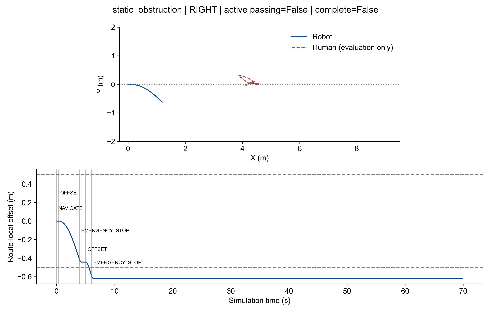

# Active Passing Experiment

## Current Problem

Frozen v0.3: Head-on/Static active passing 0/6; overtaking 0/3. This branch is based on main acafebb, not the failed social-nav-v2 branch. The frozen Classic scene/evaluator are copied byte-equivalently from feature/classic-single-pedestrian. No historical run is overwritten.

## Planner

Independent ActivePassingController; inputs are estimated tracks, self pose/velocity, route, known static map and time. Full geometric path uses quintic OFFSET, constant-offset PARALLEL and quintic RECOVER. Execution holds the offset until the estimated target is at least 0.7 m behind; it does not blindly enter the geometric recovery segment.

## Candidate Generation

Six candidates: left/right 0.6, 0.8, 1.0 m. Route coordinates use the start-to-goal unit vector and its normal. Bounded dynamic collision checks use 6 s at 0.1 s with the unchanged 0.5/0.8 m/s2 linear and 1.2 rad/s2 angular limits. Full geometric paths are also checked against static geometry; a parallel-corridor check rejects offsets narrower than the unchanged robot-plus-human radius. This is NOT a claim that the full several-meter maneuver can finish in six seconds at 0.30 m/s.

Score: 4*social_integral - predicted_progress + 0.12*(path_length+steering_effort) + 0.15*final_lateral_error. Hard collision is rejection, not a soft penalty. Nominal personal-space sigmas remain 1.2/0.7/0.8 m; no cost weight search was performed.

## State Machine

NAVIGATE -> PASS_INIT -> OFFSET -> PARALLEL -> RECOVER -> PASS_DONE. EMERGENCY_STOP interrupts unsafe or stale execution. Chosen side is retained on safety recheck; fresh ID changes may rebind only via a unique spatial match within 0.8 m and the bounded freshness interval. Temporary absent tracks may use the existing CV velocity only up to total observation age 0.8 s. No long-term blind passing. RECOVER may continue only after a fresh estimate already established the person behind.

Stationary classification records speed <0.12 m/s for 0.5 s. It does not remove the pedestrian personal-space cost or replace the unchanged KF prediction with a GT/static trajectory.

social_planning.json stores each 10 Hz plan and candidate diagnostics. active_step_trace.csv causally joins that held plan to each 60 Hz ego step: route_s/d are current ego coordinates; human/clearance/track-age fields are explicitly the last plan values, with plan_time and plan_age_s. No future plan or human GT is joined into these fields.

## Static Results

| Development run | Complete | Collision | Active passing | Max lateral m | Emergency stops | Reason |

|---|---|---|---|---:|---:|---|

| run_01 | False | False | False | 0.103 | 1 | LATCHED_STOP_REQUIRES_SAFE_REPLAN, TARGET_STALE_DURING_CONFLICT |

| run_02 | False | False | False | 0.621 | 2 | CHOSEN_SIDE_PREDICTED_COLLISION, LATCHED_STOP_REQUIRES_SAFE_REPLAN, TARGET_STALE_DURING_CONFLICT |

| run_03 | False | False | False | 0.621 | 2 | CHOSEN_SIDE_PREDICTED_COLLISION, LATCHED_STOP_REQUIRES_SAFE_REPLAN, TARGET_STALE_DURING_CONFLICT |

Development runs are not formal repeats. Run 01 is the initial implementation; run 02 includes bounded target rebinding/corridor checks. Run 03 records its exact controller source and corresponds to the final mechanism revision. All failed runs are retained.

## Head-on Results

NOT RUN: static mechanism gate requires two consecutive successes before Head-on.

## Overtaking Results

NOT RUN: Head-on mechanism gate has not passed.

## Baseline / v0.3 / ActivePassing Comparison

The 18 original frozen comparator runs remain available. They are references, not a completed 27-run formal comparison. No new formal ActivePassing benchmark was started.

| Scenario | Controller | Complete | Collision | Active passing | Overtaking |

|---|---|---:|---:|---:|---:|

| static_obstruction | baseline | 0/3 | 0/3 | 0/3 | 0/3 |

| static_obstruction | social_nav | 0/3 | 0/3 | 0/3 | 0/3 |

| headon | baseline | 3/3 | 3/3 | 0/3 | 0/3 |

| headon | social_nav | 3/3 | 3/3 | 0/3 | 0/3 |

| overtaking | baseline | 0/3 | 0/3 | 0/3 | 0/3 |

| overtaking | social_nav | 3/3 | 0/3 | 0/3 | 0/3 |

## Passing Metrics

| Run | Offset s | Parallel s | Recover s | Final lateral m | Min passing clearance m | Replans |

|---|---:|---:|---:|---:|---|---:|

| run_01 | 1.600 | 0.000 | 0.000 | 0.103 | None | 0 |

| run_02 | 4.600 | 0.000 | 0.000 | 0.621 | None | 8 |

| run_03 | 4.600 | 0.000 | 0.000 | 0.621 | None | 8 |

Replan count includes safe same-side retry checks while stopped; it is not a side-switch count. Minimum passing clearance is N/A when no longitudinal passing window is reached.

## Social Metrics

| Run | Min distance m | Stop s | Path length m | Integrated social cost | Norm <1.5 s | Omega variation |

|---|---:|---:|---:|---:|---:|---:|

| run_01 | 3.369 | 67.783 | 0.527 | 0.079 | 0.000 | 0.538 |

| run_02 | 2.821 | 64.483 | 1.388 | 0.360 | 0.000 | 0.742 |

| run_03 | 2.821 | 64.483 | 1.388 | 0.360 | 0.000 | 0.742 |

## Perception Audit

Crossing and Blind Corner: NOT RUN, per the prerequisite that all three passing mechanism gates must pass first. Their earlier perception limitation is not used to tune this planner. Static obstruction first-person inspection is part of diagnosing the currently failing mechanism.

Final static run 03 evidence: NAVIGATE 0.0 s; OFFSET 0.30 s; predicted hard-collision stop 3.90 s; same-side retry 5.00 s; stale-target stop 6.00 s. Last YOLO person exposure 5.1667 s (box x=0.07..24.22 px); first subsequent empty exposure 5.2667 s. The raw video shows the person clipping at the left image edge, then leaving view. Evaluation-only bearing from robot root to human root increases from about 49.96 degrees at 5.1667 s to 53.36 degrees at 6 s and 54.18 degrees at 7 s. The camera mount shifts exact optical bearing; these root-bearing numbers are supporting evidence, not a substitute for the image. No GT bearing reaches control.

This diagnoses this implemented maneuver, not a proof that every planner is impossible under the camera constraints. Synthetic continuously observed stationary tracks complete all four maneuver phases; real camera support during the tested turn does not. Reducing curvature or explicitly planning for visibility remains unvalidated future work. No camera change or stale-limit relaxation was used to hide this failure.

## Performance

Planning P95 includes stopped cycles; a low number must not be interpreted as sustained successful passing performance.

| Run | Planner P95 ms | YOLO responses/wall-s | RTF |

|---|---:|---:|---:|

| run_01 | 0.492 | 9.460 | 0.956 |

| run_02 | 3.955 | 8.437 | 0.846 |

| run_03 | 3.902 | 8.534 | 0.856 |

## GT Isolation

Static source inspection and simulator call-site review: no actor, scenario label, human route or evaluation state enters ActivePassingController. GT is only read after the run by the unchanged Classic evaluator/figures. Protected detector, depth configuration, KF, motion backend and controllers are unchanged.

## Limitations

Kinematic A300; simple CV prediction; one pedestrian; preset routes; no human intent model; simulation only; no real robot; no safety certification. Six-second predicted safety does not certify the whole future maneuver. The fixed forward camera and 0.8 s freshness bound can interrupt lateral maneuvers. Only limited offset magnitudes are implemented. Performance and reliability on unrun scenes are unknown.

## Videos

These MP4s are local-only under `outputs/active_passing/` and are not included in Git:

- `development/static_obstruction/active_passing/seed_17/run_01/CLASSIC_STATIC_OBSTRUCTION.mp4`
- `development/static_obstruction/active_passing/seed_17/run_02/CLASSIC_STATIC_OBSTRUCTION.mp4`
- `development/static_obstruction/active_passing/seed_17/run_03/CLASSIC_STATIC_OBSTRUCTION.mp4`
- `development/static_obstruction/active_passing/seed_17/run_03/first_person/CLASSIC_STATIC_OBSTRUCTION_FIRST_PERSON.mp4`

## Final Verdict

**ACTIVE PASSING RELEASE GATE FAIL**

Static mechanism has not achieved two consecutive active passes. Head-on, overtaking and the nine formal new runs are therefore blocked, not silently treated as passes. No main merge, VERSION update, tag or remote push. Partial lateral displacement alone is not successful passing.
