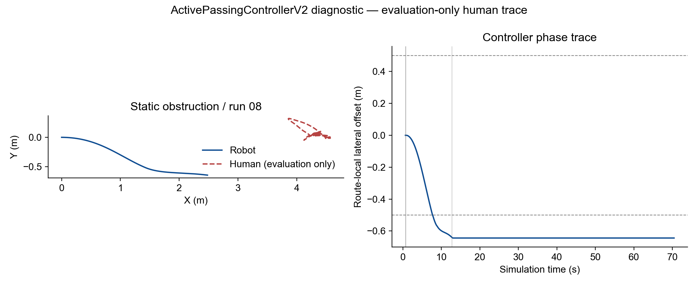

# Active Passing V2 Report

## Verdict
**STATIC MECHANISM GATE: FAIL.** Eight real development runs completed without infrastructure failure, but zero runs achieved a complete lateral pass. The required two consecutive successful static runs were not obtained, so Head-on, Overtaking and the formal nine-run benchmark were not started.

## Scope and protected baseline
This is an independent `ActivePassingControllerV2` experiment on the existing `feature/active-passing` branch. The v1 controller and `outputs/active_passing/` are preserved. The v0.3 frozen scene, detector, depth, KF, motion backend, route, human motion, `main`, `VERSION` and the `v0.3.0-social-nav` tag were not changed.

## Runtime-only controller inputs
The controller consumes estimated tracks, robot pose/velocity, the route, static occupancy geometry and runtime camera parameters. It does not consume human GT, actor state, scenario labels or human-route data. Ground truth appears only in the unchanged post-run evaluator and the explicitly labelled diagnostic figure.

## V2 mechanism
- Path-relative S-curve candidates: both sides, lateral offsets 0.65/0.80/0.95 m and transition lengths 2.0/2.5/3.0 m (18 candidates at initial selection; same-side replans retain the selected side).
- Six-second, 0.1 s receding-horizon rollout; hard Euclidean human and static-geometry checks; route-local parallel corridor check; runtime CameraParams-derived soft/hard FOV checks.
- Persistent phases: `NAVIGATE -> OFFSET -> PARALLEL -> RECOVER -> PASS_DONE`; unsafe or stale execution enters `EMERGENCY_STOP`.
- Tracker output is not modified. For planning only, a velocity is treated as unconfirmed when it is not separated from zero by the covariance-based 1.5-sigma rule; the short-horizon planner prediction is then held stationary.
- During an already selected maneuver, a fresh target inside the current hard FOV can continue while a future-window visibility warning is deferred. Initial selection and every replan retain the hard predicted-FOV gate.

## Runtime camera model
The final static runs used the live `CameraParams` model: resolution [640, 360], fx=240.000, fy=240.000, HFOV=106.260 deg, soft limit=45.130 deg, hard limit=51.130 deg, and hard-duration limit=0.900 s. No camera override or registration change was used in the default run.

## Static development results
| Run | Route complete | Collision proxy | Active pass | Phase history | Final route s (m) | Final phase | Replans | Stop reason |
|---|---:|---:|---:|---|---:|---|---:|---|
| run_01 | False | False | False | NAVIGATE → OFFSET → EMERGENCY_STOP | 0.016 | EMERGENCY_STOP | 3 | LATCHED_AFTER_INVALID_OR_STALE, REPLAN_BUDGET_OR_FEASIBILITY, SAME_SIDE_REPLAN_INVALID |
| run_02 | False | False | False | NAVIGATE → OFFSET → EMERGENCY_STOP | 0.870 | EMERGENCY_STOP | 3 | CONTINUATION_HARD_INVALID, LATCHED_AFTER_INVALID_OR_STALE, REPLAN_BUDGET_OR_FEASIBILITY |
| run_03 | False | False | False | NAVIGATE → OFFSET → EMERGENCY_STOP | 1.228 | EMERGENCY_STOP | 3 | LATCHED_AFTER_INVALID_OR_STALE, SAME_SIDE_REPLAN_INVALID |
| run_04 | False | False | False | NAVIGATE → OFFSET → EMERGENCY_STOP | 1.711 | EMERGENCY_STOP | 3 | CONTINUATION_HARD_INVALID, LATCHED_AFTER_INVALID_OR_STALE |
| run_05 | False | False | False | NAVIGATE → OFFSET → EMERGENCY_STOP | 1.687 | EMERGENCY_STOP | 3 | CONTINUATION_HARD_INVALID, LATCHED_AFTER_INVALID_OR_STALE |
| run_06 | False | False | False | NAVIGATE → OFFSET → EMERGENCY_STOP | 1.772 | EMERGENCY_STOP | 3 | CONTINUATION_HARD_INVALID, LATCHED_AFTER_INVALID_OR_STALE |
| run_07 | False | False | False | NAVIGATE → OFFSET → EMERGENCY_STOP | 1.823 | EMERGENCY_STOP | 3 | CONTINUATION_HARD_INVALID, LATCHED_AFTER_INVALID_OR_STALE |
| run_08 | False | False | False | NAVIGATE → OFFSET → EMERGENCY_STOP | 2.481 | EMERGENCY_STOP | 3 | LATCHED_AFTER_INVALID_OR_STALE, SAME_SIDE_REPLAN_INVALID |

## Failure evidence
The latest run (run 08) reached route-local s=2.481 m and d=-0.644 m, remaining in `OFFSET`; it never entered `PARALLEL`, `RECOVER` or `PASS_DONE`. At the final same-side replan, no candidate was valid: the diagnostics recorded collision and predicted-visibility rejection. The controller then latched `EMERGENCY_STOP`. This is a causal estimated-track feasibility failure, not a successful pass and not evidence that a static person was safely passed.

Detailed root-cause analysis: [ACTIVE_PASSING_V2_FAILURE_ANALYSIS.md](ACTIVE_PASSING_V2_FAILURE_ANALYSIS.md).

## Gate decision
Static mechanism successes: **0/8**. Best consecutive success streak: **0**; required streak: **2**. Therefore the gate is **FAIL** and no Head-on, Overtaking or formal runs were launched.

## Evidence files
- Development metrics: `D:/detection/robot_human_isaac6/outputs/active_passing_v2/ACTIVE_PASSING_V2_DEVELOPMENT_RESULTS.csv`
- Final status: `D:/detection/robot_human_isaac6/outputs/active_passing_v2/FINAL_STATUS.json`
- Video validation: `D:/detection/robot_human_isaac6/outputs/active_passing_v2/VIDEO_VALIDATION.json`
- Retained runs: `D:/detection/robot_human_isaac6/outputs/active_passing_v2/development/static_obstruction/active_passing_v2_default/seed_17/run_01` through `run_08`
- Latest first-person video: `run_08/first_person/CLASSIC_STATIC_OBSTRUCTION_FIRST_PERSON.mp4` (1280x720, H.264, 10 fps, 64 s).
- Source/diagnostic snapshots in each run: `active_v2_source.py`, `passing_candidates.json`, `passing_camera_model.json`, `social_planning.json`.

## Reproducibility and stopping rule
All eight failed runs are retained; no run was silently replaced by a better-looking run. No GT-derived planner tuning, detector change, route change, camera change or controller weight search was performed after the static gate evidence. No merge, tag, VERSION update or remote push was performed.
