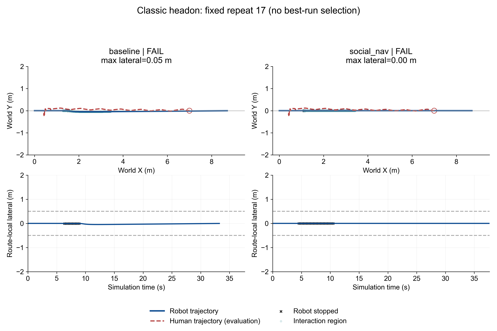
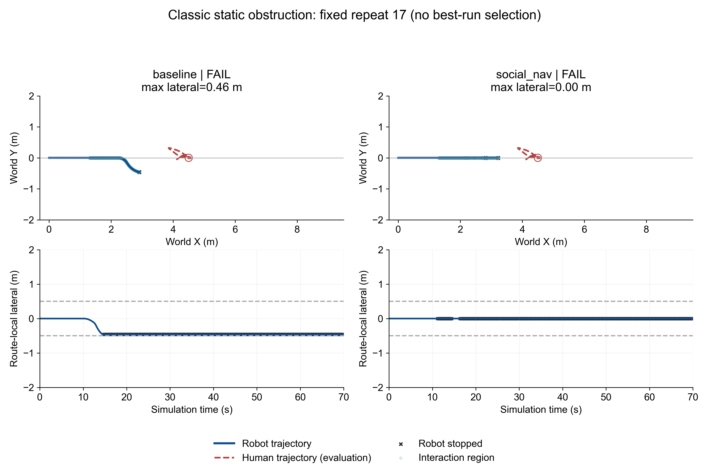

# Classic Single-Pedestrian Benchmark

## 1. Purpose

Test the existing controllers on explicit single-person conflicts, without changing controller behavior. Collision avoidance and active passing are different outcomes.

## 2. Frozen System

Base main/tag v0.3.0-social-nav = acafebb. Branch feature/classic-single-pedestrian. VERSION remains 0.3.0. No release or merge. A300 kinematic, robot RGB-D 640x360, existing mount/HFOV/clipping, YOLO11n COCO conf 0.25, robust depth, Hungarian/CV KF, DemoController and v0.3 SocialController are unchanged. No v2 planner or LiDAR.
Single-run CLI: `runtime\python.bat stage_probe.py --stage 7 --robot-model a300 --motion-mode kinematic --classic-scene --classic-scenario headon --robot-behavior social_nav --record-demo --record-first-person --headless`. The classic CLI does not use `--navwareset-scene`; only its existing fixed-asset loader adapter is shared, not its geometry. Batch order: `python classic_benchmark.py geometry`, manual raw-camera visibility review, `freeze`, `benchmark`, `figures`, `videos`, `report`. Existing completed formal runs are reused, never replaced on algorithm failure.

## 3. Scene

Independent 12 x 6 m open arena: x in [-1,11], y in [-3,3]. Robot (0,0) to (9,0). Perimeter walls only, except Blind Corner adds a 2.8 x 0.15 m wall centered at (1.4,0.825), height 2.6 m. One fixed medical-person asset per run. Standing idle is intentional for Static Obstruction; its animation root sways, but stays within 1 m longitudinal and 0.5 m lateral of the fixed obstruction position.

## 4. Scenario Definitions

All human motion is prescribed and never reads robot state. Exact definitions in CLASSIC_SINGLE_CONFIG_FROZEN.json.
| Scenario | Human start | Goal | Speed m/s | Delay s |
|---|---|---|---:|---:|
| headon | [7.0, 0.0] | [0.5, 0.0] | 0.65 | 0.000 |
| crossing | [4.5, -2.5] | [4.5, 2.5] | 0.65 | 11.154 |
| static_obstruction | [4.5, 0.0] | [4.5, 0.0] | 0.00 | 0.000 |
| overtaking | [1.8, 0.0] | [10.0, 0.0] | 0.20 | 0.000 |
| blind_corner | [4.5, 2.5] | [4.5, -2.5] | 0.65 | 11.154 |
Overtaking begins at 1.8 m, not 3 m: at nominal speeds 0.30/0.20 m/s the catch point is x=5.4 m, inside the 9 m route. This geometry choice was made before controller benchmarking, not tuned from controller results.
Native human setup is shared by all classic presets: complete-arena navmesh; dynamic robot excluded from the static bake; actor auto/obstacle avoidance disabled; blocked-speed setting reduced from native 30 to 5 so requested 0.20 m/s does not abort. Actual speed was checked from logged motion. These changes affect only new scene actor infrastructure, not robot control or any historical scene.

## 5. Evaluation Definitions

- Collision is the unchanged XY disk proxy: robot conservative radius plus 0.30 m human radius, not PhysX contact or a safety certificate. Static collision uses the unchanged disk-map clearance.
- Route completion uses each frozen controller's goal logic. Timeout is 70 simulation seconds; a timeout is retained as failure, not discarded. Metrics end at completion or timeout, excluding terminal video padding.
- Route-local axis is start-to-goal direction; lateral is its signed perpendicular projection, not hard-coded world Y. Interaction begins/ends at the first/last distance <=3 m; phase labels are evaluation-only.
- Active passing: collision-free completion, human becomes >=0.5 m behind along the route, recovered lateral <=0.3 m, and >=1 s continuous same-side motion with |lateral|>=0.5 m, speed>0.05 m/s and |relative longitudinal distance|<=2 m. STOP-only never qualifies.
- Overtaking also requires starting >=0.5 m behind the human and becoming >=0.5 m ahead. Crossing yielding requires slowing/stopping before the crossing point and resuming >0.25 m/s after the human crosses.
- Passing clearance is minimum center distance minus the same robot/human disk radii while longitudinal separation is <=0.5 m; a negative value means proxy overlap. Overtaking duration runs from interaction onset until the robot first becomes >=0.5 m ahead. Side switches count changes of signed lateral beyond +/-0.15 m; direction switches use angular speed beyond +/-0.10 rad/s; omega variation is total absolute step-to-step angular-speed change. Stop duration integrates actual speed <0.03 m/s after the first second, excluding goal stop.
- Blind Corner uses saved raw camera frames for visibility review. Detection is exposure time, reaction is controller time; both exposure-to-reaction and response arrival time are reported. Visibility is never substituted with a GT ray time.
- Repeat labels 17/23/31 are repeatability runs, not independent populations. All paired routes, speeds, delay, start and goal are identical. Asynchronous perception may differ. No failed algorithm runs are replaced.

## 6. Headon Results

- baseline: functional 0/3; scenario PASS 0/3; active_passing_success 0/3; labels ['FAIL', 'FAIL', 'FAIL'].
- social_nav: functional 0/3; scenario PASS 0/3; active_passing_success 0/3; labels ['FAIL', 'FAIL', 'FAIL'].

## 7. Crossing Results

- baseline: functional 0/3; scenario PASS 0/3; yielding_success 0/3; labels ['FAIL', 'FAIL', 'FAIL'].
- social_nav: functional 0/3; scenario PASS 0/3; yielding_success 0/3; labels ['FAIL', 'FAIL', 'FAIL'].
Post-run perception diagnostic (not a changed success gate):
| Controller/repeat | Last person exposure s | Person detections after scripted motion starts | KF track available during GT-labelled interaction |
|---|---:|---:|---:|
| baseline/17 | 8.067 | 0 | 1.5% |
| baseline/23 | 8.067 | 0 | 0.7% |
| baseline/31 | 8.067 | 0 | 0.7% |
| social_nav/17 | 8.067 | 0 | 1.5% |
| social_nav/23 | 8.067 | 0 | 0.7% |
| social_nav/31 | 8.067 | 0 | 0.7% |
Evaluation-extractor correction, documented after formal runs began: the initial extractor called any non-CRUISE state a reaction. That incorrectly included goal slowdowns. The original event is retained as first_non_cruise_time; first_reaction_time now additionally requires logged estimated human risk or an active causal stale-human guard. No GT is used for this response attribution, no scenario/controller parameter changed, and this does not turn any collision failure into a pass. Missing critical-interval detections/tracks mean the result cannot be attributed solely to planner capability.

## 8. Static Obstruction Results

- baseline: functional 0/3; scenario PASS 0/3; active_passing_success 0/3; labels ['FAIL', 'FAIL', 'FAIL'].
- social_nav: functional 0/3; scenario PASS 0/3; active_passing_success 0/3; labels ['FAIL', 'FAIL', 'FAIL'].

## 9. Overtaking Results

- baseline: functional 0/3; scenario PASS 0/3; overtaking_success 0/3; labels ['FAIL', 'FAIL', 'FAIL'].
- social_nav: functional 3/3; scenario PASS 0/3; overtaking_success 0/3; labels ['YIELD-ONLY', 'YIELD-ONLY', 'YIELD-ONLY'].

## 10. Blind Corner Results

- baseline: functional 0/3; scenario PASS 0/3; scenario_pass 0/3; labels ['FAIL', 'FAIL', 'FAIL'].
- social_nav: functional 0/3; scenario PASS 0/3; scenario_pass 0/3; labels ['FAIL', 'FAIL', 'FAIL'].
| Controller/repeat | First visible | First detection | Detection response | First human response | Exposure-to-response s |
|---|---:|---:|---:|---:|---:|
| baseline/17 | 5.967 | 6.267 | 6.417 | N/A | N/A |
| baseline/23 | 5.967 | 6.267 | 6.517 | N/A | N/A |
| baseline/31 | 5.967 | 6.367 | 6.517 | N/A | N/A |
| social_nav/17 | 5.967 | 6.267 | 6.417 | N/A | N/A |
| social_nav/23 | 5.967 | 6.267 | 6.417 | N/A | N/A |
| social_nav/31 | 6.067 | 6.267 | 6.417 | N/A | N/A |
Post-run perception diagnostic (not a changed success gate):
| Controller/repeat | Last person exposure s | Person detections after scripted motion starts | KF track available during GT-labelled interaction |
|---|---:|---:|---:|
| baseline/17 | 7.267 | 0 | 0.0% |
| baseline/23 | 7.267 | 0 | 0.0% |
| baseline/31 | 7.167 | 0 | 0.0% |
| social_nav/17 | 7.267 | 0 | 0.0% |
| social_nav/23 | 7.267 | 0 | 0.0% |
| social_nav/31 | 7.267 | 0 | 0.0% |
Evaluation-extractor correction, documented after formal runs began: the initial extractor called any non-CRUISE state a reaction. That incorrectly included goal slowdowns. The original event is retained as first_non_cruise_time; first_reaction_time now additionally requires logged estimated human risk or an active causal stale-human guard. No GT is used for this response attribution, no scenario/controller parameter changed, and this does not turn any collision failure into a pass. Missing critical-interval detections/tracks mean the result cannot be attributed solely to planner capability.

## 11. Baseline vs v0.3

Arithmetic means of three runs; completion-only travel means are censored by failure, so completion count and observed duration must be read together.
| Scene | Controller | Complete | Collision | Min distance m | Travel s | Observed s | Lateral m | Stop s | Social cost |
|---|---|---:|---:|---:|---:|---:|---:|---:|---:|
| headon | baseline | 3/3 | 3/3 | 0.064 | 33.167 | 33.167 | 0.047 | 2.733 | 3.511 |
| headon | social_nav | 3/3 | 3/3 | 0.115 | 37.583 | 37.583 | 0.000 | 6.183 | 4.922 |
| crossing | baseline | 3/3 | 3/3 | 0.055 | 29.317 | 29.317 | 0.000 | 0.000 | 3.158 |
| crossing | social_nav | 3/3 | 3/3 | 0.055 | 30.800 | 30.800 | 0.000 | 0.000 | 3.158 |
| static_obstruction | baseline | 0/3 | 0/3 | 1.265 | N/A | 70.000 | 0.466 | 55.283 | 11.660 |
| static_obstruction | social_nav | 0/3 | 0/3 | 0.909 | N/A | 70.000 | 0.000 | 57.050 | 20.540 |
| overtaking | baseline | 0/3 | 0/3 | 1.554 | N/A | 70.000 | 0.408 | 19.167 | 3.084 |
| overtaking | social_nav | 3/3 | 0/3 | 1.329 | 45.728 | 45.728 | 0.000 | 2.294 | 6.795 |
| blind_corner | baseline | 3/3 | 3/3 | 0.183 | 29.317 | 29.317 | 0.000 | 0.000 | 3.200 |
| blind_corner | social_nav | 3/3 | 3/3 | 0.183 | 30.800 | 30.800 | 0.000 | 0.000 | 3.200 |
Paired human-motion audit over common simulation timestamps: maximum XY difference across all 15 controller pairs = 0.000000 m. Preset, robot start/goal, human speed/delay, static geometry and native-human settings are checked identical.

## 12. Social Metrics

Nominal ellipses remain front/rear/side 1.2/0.7/0.8 m. Integrated social cost and normalized distance <1.5 duration are heuristic proxemic metrics, not human comfort labels. A larger minimum distance alone does not prove better social behavior.
| Scene | Controller | Min normalized distance | Time norm <1.5 s | Time norm <1 s | Turn-direction switches | Omega total variation rad/s |
|---|---|---:|---:|---:|---:|---:|
| headon | baseline | 0.079 | 3.983 | 2.744 | 1.000 | 1.284 |
| headon | social_nav | 0.144 | 6.133 | 3.850 | 0.000 | 0.000 |
| crossing | baseline | 0.070 | 3.900 | 2.600 | 0.000 | 0.000 |
| crossing | social_nav | 0.070 | 3.900 | 2.600 | 0.000 | 0.000 |
| static_obstruction | baseline | 1.105 | 3.517 | 0.000 | 1.000 | 1.800 |
| static_obstruction | social_nav | 0.894 | 28.061 | 2.483 | 0.000 | 0.000 |
| overtaking | baseline | 1.488 | 0.083 | 0.000 | 6.333 | 6.627 |
| overtaking | social_nav | 1.488 | 0.083 | 0.000 | 0.000 | 0.000 |
| blind_corner | baseline | 0.203 | 3.900 | 2.700 | 0.000 | 0.000 |
| blind_corner | social_nav | 0.203 | 3.900 | 2.700 | 0.000 | 0.000 |

## 13. Videos

Fixed repeat 17 is used for every showcased video; no best-run selection or stitched runs. Third-person for both controllers in all five scenes; robot-camera first-person for Head-on and Blind Corner. First-person boxes use matching exposure IDs, never GT. Encoded 10 fps is not wall-clock throughput. The unchanged first-person exporter encodes returned camera exposures at 10 fps; missed capture ticks can compress playback. VIDEO_VALIDATION.json reports video duration versus recorded simulation span. Event timings and evaluation use simulation logs, not the video player clock.

All videos below are local-only under `outputs/classic_single_pedestrian/benchmark/`; they are not part of this Git repository:

- `headon/baseline/seed_17/run_01/CLASSIC_HEADON.mp4`
- `headon/baseline/seed_17/run_01/first_person/CLASSIC_HEADON_FIRST_PERSON.mp4`
- `headon/social_nav/seed_17/run_01/CLASSIC_HEADON.mp4`
- `headon/social_nav/seed_17/run_01/first_person/CLASSIC_HEADON_FIRST_PERSON.mp4`
- `crossing/baseline/seed_17/run_01/CLASSIC_CROSSING.mp4`
- `crossing/social_nav/seed_17/run_01/CLASSIC_CROSSING.mp4`
- `static_obstruction/baseline/seed_17/run_01/CLASSIC_STATIC_OBSTRUCTION.mp4`
- `static_obstruction/social_nav/seed_17/run_01/CLASSIC_STATIC_OBSTRUCTION.mp4`
- `overtaking/baseline/seed_17/run_01/CLASSIC_OVERTAKING.mp4`
- `overtaking/social_nav/seed_17/run_01/CLASSIC_OVERTAKING.mp4`
- `blind_corner/baseline/seed_17/run_01/CLASSIC_BLIND_CORNER.mp4`
- `blind_corner/baseline/seed_17/run_01/first_person/CLASSIC_BLIND_CORNER_FIRST_PERSON.mp4`
- `blind_corner/social_nav/seed_17/run_01/CLASSIC_BLIND_CORNER.mp4`
- `blind_corner/social_nav/seed_17/run_01/first_person/CLASSIC_BLIND_CORNER_FIRST_PERSON.mp4`

## 14. Performance

Same third-person rendering for paired runs. First-person recording is enabled symmetrically for repeat 17 Head-on/Blind Corner. Timings describe this workstation under its actual load, not a controlled isolated hardware comparison.
| Scene | Controller | YOLO responses / wall-s | RTF |
|---|---|---:|---:|
| headon | baseline | 4.814 | 0.502 |
| headon | social_nav | 5.162 | 0.541 |
| crossing | baseline | 5.959 | 0.616 |
| crossing | social_nav | 6.195 | 0.646 |
| static_obstruction | baseline | 9.974 | 1.029 |
| static_obstruction | social_nav | 10.490 | 1.067 |
| overtaking | baseline | 7.306 | 0.768 |
| overtaking | social_nav | 6.853 | 0.709 |
| blind_corner | baseline | 5.541 | 0.624 |
| blind_corner | social_nav | 5.536 | 0.620 |

## 15. GT Isolation

Only estimated tracks, robot self pose, route and static map reach the controllers. Human GT, interaction phases, passing success and visibility review are post-run evaluation. Human scripts use only own preset and simulation clock.

## 16. Limitations

Kinematic A300; preset single-human routes; heuristic proxemics; no human intent model; no human-subject evaluation; simulation only; no safety certification. Camera sampling and imperfect detection/association can affect controller behavior. Agent arrival tolerance means actual paths are validated from logged motion, not presumed exact from requested endpoints.

## 17. Conclusion

v0.3 active passing successes across Head-on/Static: 0/6. Overtaking successes: 0/3. These are observed capabilities in this suite, not general claims.
The current v0.3 does not demonstrate reliable active social passing in this benchmark; its behavior must be characterized from the yielding/stopping and failure evidence above.
Direct answers for this frozen suite:
1. Head-on: both controllers brake/stop but incur collision-proxy overlap in all three repeats. v0.3 has zero lateral displacement; it does not execute offset-pass-recover. Stopping is not safe yielding when the prescribed human continues straight into the robot.
2. Static obstruction: both controllers stop until the 70 s timeout. Baseline moves laterally about 0.46 m but never completes the pass; v0.3 has zero lateral displacement. Neither navigates around the standing person.
3. Crossing: neither controller yields successfully; all repeats collide. Detections cease before the human begins crossing, and there are no exported tracks in the conflict interval. This is an end-to-end perception/control failure, not an isolated planner comparison.
4. Overtaking: v0.3 safely follows to the goal in all three repeats, but never gets ahead of the human and never creates lateral offset. Baseline times out. The generic YIELD-ONLY label for v0.3 in the CSV denotes stopping/following without passing here, not successful overtaking.
5. Blind corner: initial visual occlusion is confirmed, followed by valid person detections around 6.3 s. The person subsequently leaves the forward view before moving across the route. Neither controller produces a logged human-risk response, and all repeats collide. Goal slowdown is not counted as pedestrian reaction.
Overall: current v0.3 is primarily prediction-aware speed control/stopping/following, not demonstrated active social passing. Reliable yielding under all conflicts is also not established. Safe goal completion is demonstrated only for the overtaking/following setup, without overtaking.
Next-step evidence, not changes made in this task: separate loss of front-camera support in lateral encounters from the inability to generate sustained lateral passing when a track is available. No controller, camera or human-route tuning was performed after the scenario freeze.

## Infrastructure and pre-benchmark geometry record

- development\headon\diagnostic\seed_17\run_01\INVALID_INFRASTRUCTURE.json: {'status': 'INVALID_INFRASTRUCTURE', 'reason': 'DiagnosticRoute.done was numpy.bool, causing JSON serialization failure after simulation. Fixed by bool conversion in diagnostic-only class. No controller change. Original log, failure and video retained.'}
- development\headon\diagnostic\seed_17\run_03\INVALID_INFRASTRUCTURE.json: {'reason': 'Missing summary or failure.txt', 'log': 'D:\\detection\\robot_human_isaac6\\outputs\\classic_single_pedestrian\\development_headon_diagnostic_17.log'}
- development\blind_corner\diagnostic\seed_17\run_01\INVALID_GEOMETRY.json: {'reason': 'Camera review 10-17 s: wall occludes human until human is outside front FOV. No visible emergence, so unsuitable blind-corner perception test. Before any controller benchmark, shorten wall from 4.3 to 3.5 m while preserving robot/human routes and timing. Original run retained.'}
- development\blind_corner\diagnostic\seed_17\run_02\INVALID_GEOMETRY.json: {'reason': 'Raw RGB review across 0-20 s still has no visible person with 3.5 m wall. Pre-benchmark geometry gate fails. Further shorten occluder to 2.8 m; robot/human trajectories and all perception/controller settings unchanged. No controller result used in geometry selection.'}
- development\crossing\diagnostic\seed_17\run_01\INVALID_GEOMETRY.json: {'reason': 'Superseded pre-freeze geometry validation: repeat with full-arena navmesh and explicitly disabled human auto/obstacle avoidance. Original conflict evidence retained; not an algorithm failure.'}
- development\headon\diagnostic\seed_17\run_02\INVALID_GEOMETRY.json: {'reason': 'Superseded pre-freeze geometry validation: repeat with full-arena navmesh and explicitly disabled human auto/obstacle avoidance. Original conflict evidence retained; not an algorithm failure.'}
- development\overtaking\diagnostic\seed_17\run_01\INVALID_GEOMETRY.json: {'reason': 'Human goal x=10 lies outside default navigation volume ending x=8; move_to rejected. Robot passed an idle person, not a valid overtaking conflict. Preserved before formal benchmark.'}
- development\overtaking\diagnostic\seed_17\run_02\INVALID_GEOMETRY.json: {'reason': '8-second infrastructure probe confirmed closest reachable x=8 and move_to=-1 for x=10. Not a complete geometry run or controller result.'}
- development\overtaking\diagnostic\seed_17\run_03\INVALID_GEOMETRY.json: {'reason': 'Goal accepted after navmesh fix, but requested 0.2 m/s motion stalls after 1 s under native navBlockedSpeedThreshold=30 default. Not genuine overtaking. Preserve and test actor-only blocked-speed setting below requested speed; disable native human auto avoidance for all classic presets so people never yield to robot.'}
- development\overtaking\diagnostic\seed_17\run_04\INVALID_GEOMETRY.json: {'reason': 'Valid slow-motion probe, preserved. Superseded final geometry validation after excluding dynamic robot from static human navmesh bake, shared across all five presets. Not an algorithm failure.'}
- development\static_obstruction\diagnostic\seed_17\run_01\INVALID_GEOMETRY.json: {'reason': 'Superseded pre-freeze geometry validation: repeat with full-arena navmesh and explicitly disabled human auto/obstacle avoidance. Official idle root sway remains permitted inside fixed obstruction zone; no controller result used.'}
