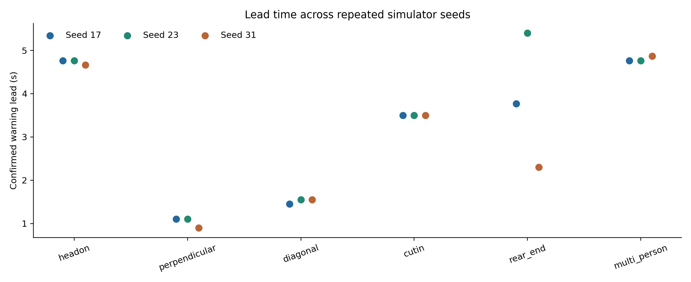
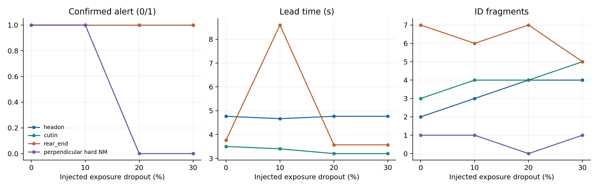
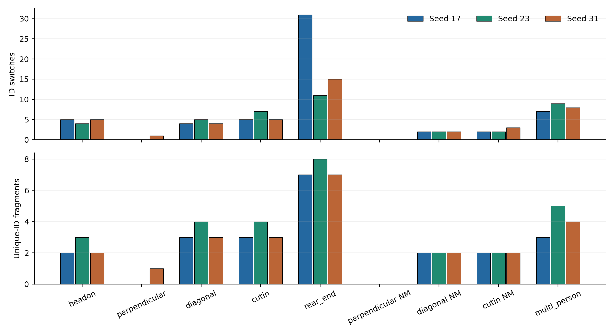

# Third-person collision-prediction robustness evaluation

## 1. Frozen Baseline

The prediction algorithm is frozen at commit `5e6231285135e4cc6cf5c7c72eb7561a0f6f9f40` (see [FROZEN_PROTOCOL.md](FROZEN_PROTOCOL.md)). All runs use COCO YOLO26n, fixed third-person RGB-D, duplicate-aware Hungarian CV-KF, 5 s CPA/rollout, and two-consecutive-exposure system confirmation. The only changes are the predeclared scene delays and the experimental post-YOLO dropout injector. GT is used offline only.

## 2. Multi-seed Setup

Nine original scenarios × simulator seeds 17, 23, 31 = 27 runs. The original seed-17 optimized runs were reused; no best-run selection. These are mechanism-level repeats, not a statistical safety benchmark. Per-scenario mean, median, min, and max for continuous metrics are in `MULTISEED_SCENARIO_SUMMARY.csv`.

## 3. Multi-seed Results

| Scenario | Confirmed alerts / 3 | Actual collisions / 3 | Confirmed FP / 3 | Lead mean / median / min / max (s) |
| --- | ---: | ---: | ---: | --- |
| headon_collision | 3/3 | 3/3 | 0/3 | 4.73 / 4.77 / 4.67 / 4.77 |
| perpendicular_collision | 3/3 | 3/3 | 0/3 | 1.03 / 1.10 / 0.90 / 1.10 |
| diagonal_collision | 3/3 | 3/3 | 0/3 | 1.52 / 1.55 / 1.45 / 1.55 |
| cutin_collision | 3/3 | 3/3 | 0/3 | 3.50 / 3.50 / 3.50 / 3.50 |
| rear_end_collision | 3/3 | 3/3 | 0/3 | 3.82 / 3.77 / 2.30 / 5.40 |
| perpendicular_nearmiss | 0/3 | 0/3 | 0/3 | — |
| diagonal_nearmiss | 0/3 | 0/3 | 0/3 | — |
| cutin_nearmiss | 0/3 | 0/3 | 0/3 | — |
| multi_person_collision | 3/3 | 3/3 | 0/3 | 4.80 / 4.77 / 4.77 / 4.87 |

Five single-person collision classes: 15/15 confirmed alerts, 0 FN. Three original near-miss classes: 0/9 confirmed false alarms. Multi-person is audited separately.

## 4. Hard Near-miss Design

Only human start delays differ; paths, speeds, robot motion, camera, collision radius, and risk logic remain fixed. Delay selection was made before any hard-case predictor run and is documented in `FROZEN_PROTOCOL.md`. The diagonal and cut-in changes exceed the suggested 0.3–0.8 s example because their original closest distances were too large for a hard case.

## 5. Hard Near-miss Results

| Case | Actual min distance (m) | Actual collision | Raw-risk frames | Confirmed-risk frames | Min finite dCPA (m) | First-risk tCPA (s) |
| --- | ---: | --- | ---: | ---: | ---: | ---: |
| perpendicular_nearmiss_hard | 1.192 | False | 5 | 2 | 0.464 | 4.65 |
| diagonal_nearmiss_hard | 1.244 | False | 0 | 0 | 1.113 | — |
| cutin_nearmiss_hard | 1.239 | False | 2 | 1 | 1.251 | — |

A confirmed alert when the actual minimum distance exceeds 0.903 m is an observed false alarm; it is not corrected post hoc. dCPA is reported only when the analytic CPA time lies inside the 5 s horizon, while the collision flag comes from the separate discrete rollout; therefore a raw risk can have no finite reported tCPA.

## 6. Detection Dropout Setup

Independent seed 101 deletes the entire person-detection set at each selected exposure after YOLO and before depth projection/tracking. Rates: 0%, 10%, 20%, 30%; one simulator seed (17), four scenes. Raw YOLO boxes and post-dropout boxes are both recorded. 0% references reuse matching runs.

## 7. Dropout Results

| Scene | Dropout | Injected exposures | Confirmed alert | Confirmed FP | FN | Lead (s) | Track support | Position MAE (m) | Velocity MAE (m/s) | ID switches | Fragments |
| --- | ---: | ---: | --- | --- | --- | ---: | ---: | ---: | ---: | ---: | ---: |
| headon_collision | 0% | 0 | True | False | False | 4.77 | 91.1% | 0.173 | 0.074 | 5 | 2 |
| headon_collision | 10% | 42 | True | False | False | 4.67 | 80.5% | 0.179 | 0.082 | 3 | 3 |
| headon_collision | 20% | 68 | True | False | False | 4.77 | 70.8% | 0.177 | 0.067 | 5 | 4 |
| headon_collision | 30% | 101 | True | False | False | 4.77 | 62.5% | 0.173 | 0.071 | 5 | 4 |
| cutin_collision | 0% | 0 | True | False | False | 3.50 | 48.1% | 0.169 | 0.094 | 5 | 3 |
| cutin_collision | 10% | 42 | True | False | False | 3.40 | 40.7% | 0.171 | 0.105 | 6 | 4 |
| cutin_collision | 20% | 68 | True | False | False | 3.20 | 38.1% | 0.172 | 0.106 | 5 | 4 |
| cutin_collision | 30% | 101 | True | False | False | 3.20 | 32.7% | 0.172 | 0.120 | 7 | 5 |
| rear_end_collision | 0% | 0 | True | False | False | 3.77 | 79.1% | 0.190 | 0.026 | 31 | 7 |
| rear_end_collision | 10% | 42 | True | False | False | 8.60 | 69.3% | 0.172 | 0.024 | 12 | 6 |
| rear_end_collision | 20% | 68 | True | False | False | 3.57 | 62.8% | 0.184 | 0.027 | 20 | 7 |
| rear_end_collision | 30% | 101 | True | False | False | 3.57 | 54.2% | 0.178 | 0.025 | 15 | 5 |
| perpendicular_nearmiss_hard | 0% | 0 | True | True | False | — | 77.4% | 0.127 | 0.068 | 1 | 1 |
| perpendicular_nearmiss_hard | 10% | 42 | True | True | False | — | 67.6% | 0.127 | 0.067 | 1 | 1 |
| perpendicular_nearmiss_hard | 20% | 68 | False | False | False | — | 62.2% | 0.126 | 0.068 | 0 | 0 |
| perpendicular_nearmiss_hard | 30% | 101 | False | False | False | — | 54.2% | 0.127 | 0.073 | 1 | 1 |

- headon_collision: no confirmed FP/FN through the tested 30% rate.
- cutin_collision: no confirmed FP/FN through the tested 30% rate.
- rear_end_collision: no confirmed FP/FN through the tested 30% rate.
- perpendicular_nearmiss_hard: first observed confirmed FP/FN at 0% injected dropout.

No collision-recall failure was observed at the tested rates through 30%, so a recall failure boundary was not located. The hard-near-miss false alert disappears at 20–30% in this single dropout-seed experiment because risk observations are removed; that is not evidence that missing detections improve the system.

## 8. Multi-person Stability

| Seed | Person | Actual collision | Raw-risk frames | Confirmed-risk frames | First confirmed (s) | Associated frames | Unique IDs |
| ---: | --- | --- | ---: | ---: | ---: | ---: | ---: |
| 17 | Person 1 | True | 66 | 63 | 1.92 | 316 | 4 |
| 17 | Person 2 | False | 0 | 0 | — | 349 | 1 |
| 17 | Person 3 | False | 0 | 0 | — | 288 | 1 |
| 23 | Person 1 | True | 67 | 64 | 1.92 | 309 | 5 |
| 23 | Person 2 | False | 0 | 0 | — | 349 | 1 |
| 23 | Person 3 | False | 0 | 0 | — | 290 | 2 |
| 31 | Person 1 | True | 67 | 64 | 1.82 | 310 | 5 |
| 31 | Person 2 | False | 0 | 0 | — | 349 | 1 |
| 31 | Person 3 | False | 0 | 0 | — | 288 | 1 |

Cross-person confirmation events detected with unique GT-assigned risk identities: **0**. See `multi_person_audit/CROSS_PERSON_CONFIRMATION_EVENTS.json`. Events involving unassociated tracks are not provably attributable to a person. Raw-risk-frame ranking by seed: 17: Person 1 > Person 2 > Person 3; 23: Person 1 > Person 2 > Person 3; 31: Person 1 > Person 2 > Person 3.

## 9. Tracking Fragmentation

Total multi-seed ID switches: 139; unique-ID fragments: 74. Rear-end fragments by seed: 17: 7, 23: 8, 31: 7.

## 10. Warning Lead Time

Lead is actual first collision-proxy time minus first confirmed alert time. It is undefined for near-misses and missed collisions. A positive lead does not prove calibrated future trajectory accuracy.

## 11. Runtime

| Phase | YOLO mean (ms) | Tracking mean (ms) | Risk mean (ms) |
| --- | ---: | ---: | ---: |
| multiseed | 16.33 | 0.24 | 0.05 |
| hard_nearmiss | 14.45 | 0.21 | 0.04 |
| dropout | 14.19 | 0.20 | 0.04 |

## 12. Failure Cases

4 run rows satisfy a failure/invalid-hard-geometry condition.

- hard_nearmiss / perpendicular_nearmiss_hard / seed 17 / dropout 0%: confirmed FP=True, FN=False, actual collision=False, min GT distance=1.192 m.
- hard_nearmiss / cutin_nearmiss_hard / seed 17 / dropout 0%: confirmed FP=True, FN=False, actual collision=False, min GT distance=1.239 m.
- dropout / perpendicular_nearmiss_hard / seed 17 / dropout 0%: confirmed FP=True, FN=False, actual collision=False, min GT distance=1.192 m.
- dropout / perpendicular_nearmiss_hard / seed 17 / dropout 10%: confirmed FP=True, FN=False, actual collision=False, min GT distance=1.192 m.

## 13. Limitations

Three seeds and one dropout seed do not establish a safety bound. Injector drops whole exposures independently, not burst losses or selective person omissions. The fixed camera, scripted paths, collision proxy, and simulator-to-wall-time distinction limit generalization. Repeated simulator runs can show small human-trajectory and raw-YOLO count differences even at the same seed; logged GT minimum distances and raw box counts make this visible. Dropout comparisons are therefore not an exact paired replay of one detector stream. Position and velocity MAE are conditional on GT-associated active tracks; missing frames do not contribute to those errors, so inspect track-support rate alongside them. The system-level two-frame rule is not inherently person-specific. Offline GT assignment uses a 1.5 m gate and can leave ambiguous tracks unassigned.

## 14. Conclusion

The frozen baseline produced 15/15 confirmed single-person collision alerts across seeds, while 2/3 frozen hard near-misses produced confirmed false alarms. In the three collision scenes under tested dropout rates, 0/12 runs were confirmed misses. These are observed mechanism-level outcomes, not a safety guarantee. The hard-near-miss false alarms justify a *future controlled comparison* against a learned short-horizon predictor, but this evaluation does not introduce one or establish that it would be better.
